  

  
  

### 👋 Привет! Я — Бехруз (beorht) 

Я создаю масштабируемые Backend-системы, интеллектуальные AI-решения и кроссплатформенные приложения. Мой фокус — объединение мощи нейросетей с надежной архитектурой для решения реальных проблем безопасности и автоматизации.

---

### 🛠️ Мой технологический стек

#### **[ Backend & Systems ]**
- **Core:**    
- **Frameworks:**   
- **Databases:**   

#### **[ Frontend & UI ]**
- **Web:**   
- **Desktop/TUI:**  

#### **[ AI & Security ]**
- **AI/ML:** `Google Gemini API`, `NLP`, `Prompt Engineering`, `Vision AI`, `Embeddings`
- **Security:** `Web Vulnerability Scanning`, `Fraud Detection Systems`, `OSINT Tools`

---

### 🌟 Избранные проекты

#### 🛡️ [ScamGuard AI](https://github.com/beorht/ScamGuard-AI)
**Система защиты от мошенничества на базе ИИ.**
- Реализовал многоуровневый пайплайн анализа (NLP, Vision, Rule Engine, Embeddings).
- Стек: **FastAPI**, **aiogram 3.x**, **Google Gemini**, **SQLAlchemy**.
- Результат: распознавание скама в объявлениях за <15 секунд.

#### 🏗️ [Aregami](https://github.com/beorht/Aregami)
**Современная веб-платформа с микросервисной архитектурой.**
- Backend на **NestJS** с кэшированием в **Redis** и аутентификацией через **JWT/Passport**.
- Frontend на **Next.js** с использованием **App Router** и **TailwindCSS**.

#### ♟️ [Chess Local](https://github.com/beorht/chess_local)
**Терминальные шахматы на C++17.**
- Использование библиотеки **FTXUI** для создания интерактивного интерфейса в консоли.
- Чистая реализация правил игры и архитектуры на C++.

#### 🎮 [BallFighterOnline](https://github.com/beorht/BallFighterOnline)
**Сетевой многопользовательский баттлер.**
- Реализация сетевого протокола синхронизации состояний.
- Стек: **Python**, **Pygame**, **Custom Networking**.

---

### 📊 Статистика активности

  
  

  
  <!-- img src="https://streak-stats.demolab.com/?user=beorht&theme=radical" /-->

---

### 📫 Как меня найти
- [Telegram](https://t.me/Behruz_Muhammadjonov)
- [LinkedIn](https://www.linkedin.com/in/behruz-muhammadjonov-631820241?utm_source=share_via&utm_content=profile&utm_medium=member_android)

---

  <i>"Building the future with Python, C++, and a touch of AI magic."</i>

